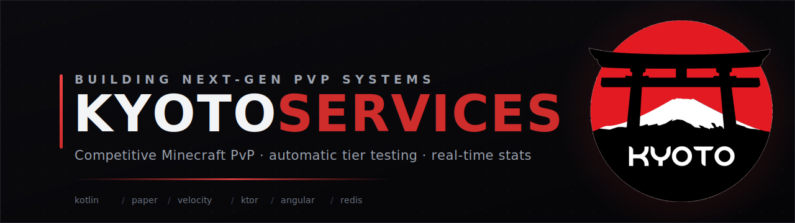
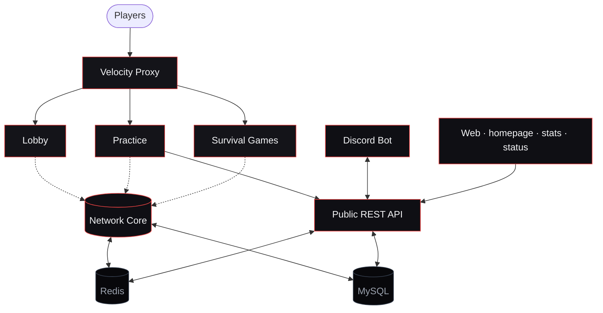

<!-- KyotoServices · organization profile -->

  

  <b>The development team behind <a href="https://kyotopvp.com">KyotoPVP</a></b> — a premium, competitive Minecraft PvP network 
  with automatic tier testing, real-time stats, and a thriving global community.

  
  
  
  
  

  

---

## 👋 Who we are

**Kyoto Services** is the team that designs, builds, and operates the technology stack powering the
KyotoPVP network — from the in-game plugins that run matches, to the services that score every
fight, to the websites and Discord tooling players see every day.

We care about **competitive integrity**, **low-latency gameplay**, and **a clean player experience**.
Everything below is built and maintained in-house.

## 🧩 What we build

> A purpose-built stack — Kotlin on the server side, Angular on the web, glued together by Redis and a REST core.

### ⚔️ In-game (Minecraft)

| Component | What it does |
|-----------|--------------|
| **Network Core** | Ranks, punishments, knockback, HUD, menus & cross-server state — the shared foundation every game server runs on. |
| **Practice** | Competitive duels, ranked ELO, tournaments, parties & custom arenas. |
| **Lobby** | The hub experience — server selector, cosmetics & scoreboards. |
| **Proxy** | Cross-server chat, parties, friends & network routing. |
| **Anticheat** | A custom, packet-level, latency-compensated anticheat tuned for high-level PvP. |

### 🌐 Services & web

| Component | What it does |
|-----------|--------------|
| **Public API** | The REST backbone — player profiles, leaderboards, ELO & seasons. |
| **Discord Bot** | Account linking, rank ↔ role sync, moderation & live network vitals. |
| **kyotopvp.com** | The public homepage & announcements. |
| **stats.kyotopvp.com** | Player stats, leaderboards & MCRanks-style profiles. |
| **Status page** | Real-time network health, uptime history & incident reports. |

## 🛠️ Tech stack

  
  
  
  
  
  

  
  
  
  
  
  

## 🏗️ Architecture at a glance

High-level view. Real-time cross-server state flows over Redis pub/sub; durable data lives in MySQL; the REST core ties web, Discord, and game servers together.

## 📊 By the numbers

  
  &nbsp;
  
  &nbsp;
  
  &nbsp;
  

## 🔗 Connect

<table align="center">
  <tr>
    <td align="center"><a href="https://kyotopvp.com">🌐 <b>Website</b></a></td>
    <td align="center"><a href="https://discord.kyotopvp.com">💬 <b>Discord</b></a></td>
    <td align="center"><a href="https://stats.kyotopvp.com">📈 <b>Stats</b></a></td>
    <td align="center"><a href="https://store.kyotopvp.com">🛒 <b>Store</b></a></td>
    <td align="center"><a href="https://twitter.com/kyotopvp">🐦 <b>@kyotopvp</b></a></td>
  </tr>
</table>

  Hop on at <code>play.kyotopvp.com</code> — Java Edition 1.7 through 26.2.

---

  Made with ⚔️ &nbsp;by the <b>Kyoto Services</b> team · © 2026 KyotoPVP

